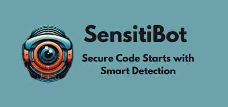

  

# 🤖 SensitiBot

SensitiBot is a GitHub bot designed to automatically detect and manage sensitive data leaks in your repositories.
It supports multiple file types, customizable detection patterns, AI-based detection with Gemini, and flexible configuration.

---

## ✨ Features

- 🔍 **Automatic Detection:** Scans files for sensitive data such as passwords, API keys, tokens, personal information, and more.
- 🧠 **Multiple Detection Engines:** Choose between traditional regex/pattern-based detection and Google Gemini AI detection.
- 🛠️ **Customizable Patterns:** Easily add or modify detection patterns.
- ⚙️ **Configurable Actions:** Alert via GitHub issues, automatically create pull requests to remove sensitive data, or both.
- 🚫 **Exclusions:** Define words, phrases, or patterns to ignore.
- 📝 **Custom AI Prompt:** Personalize the prompt sent to Gemini for advanced AI detection.
- 📂 **Supports Multiple File Types:** Works with `.txt`, `.csv`, `.md`, `.json`, `.yaml`, `.yml`, and more.

---

## ⚡ How It Works

1. **On Push:** When code is pushed to the repository, SensitiBot scans the changed files.
2. **Detection:** Depending on your configuration, it uses regex patterns or Gemini AI to detect sensitive content.
3. **Action:** Based on your settings, it creates an issue, opens a pull request to remove sensitive data, or both.

---

## ⚙️ Configuration

All configuration is done via the `configuration-sensitibot.txt` file in your repository root.
Follow the exact instructions that this file gives.
You can get the latest template from this repository.

---

## 📄 Supported File Types

- `.txt`
- `.csv`
- `.md`
- `.json`
- `.yaml`, `.yml`

---

## 🧩 Detection Patterns

Patterns are defined in `utils/patterns.js`.
You can extend or modify them as needed.

---

## 🚀 How to Use

To install and use SensitiBot in your GitHub repository, follow these steps:

1. **🔗 Install the SensitiBot GitHub App**

   Go to [instalation link](https://github.com/apps/sensitibot) and click on **Install**.Select the repositories where you want SensitiBot to be active.
2. **📝 Add the Configuration File**

   In each repository where you want SensitiBot to work, add a file named `configuration-sensitibot.txt` in the root directory.This file controls how the bot behaves (detection engine, actions, exclusions, patterns, etc.).
3. **⚒️ Customize Your Configuration**

   Edit `configuration-sensitibot.txt` to fit your needs.You can specify:

   - 📂 Which file types to scan
   - 🚨 What actions to take (alert, block, both)
   - 🧠 Which detection engine to use (patterns, gemini, or both)
   - 🚫 Exclusions and custom patterns
   - 🤖 A custom prompt for Gemini AI

   See the **Configuration** section above for details and examples.
4. **⬆️ Push Code to Your Repository**

   Whenever you push code to your repository, SensitiBot will automatically scan the changed files and take action according to your configuration.

---

## 🛠️ Development

- Main logic: `index.js`
- Detection patterns: `utils/patterns.js`
- Detection logic: `utils/securityPatterns.js`
- GitHub integration: `utils/githubUtils.js`
- Configuration parsing: `utils/fileUtils.js`

---

## ⚠️ Disclaimer

SensitiBot is a tool to help automate the detection of sensitive data, but **it is not a substitute for secure development practices**.
Always review detected issues and PRs before merging or taking action.

---
